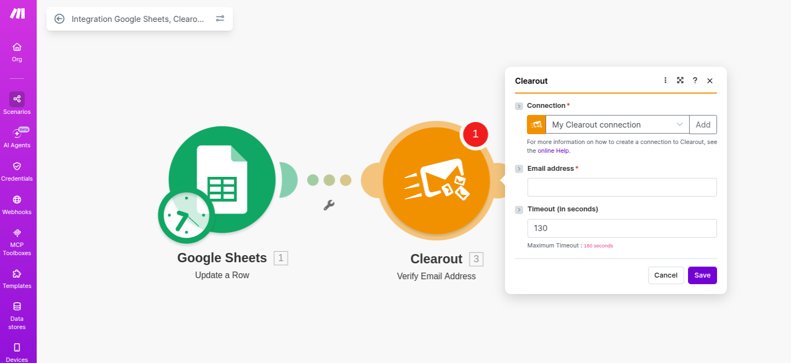
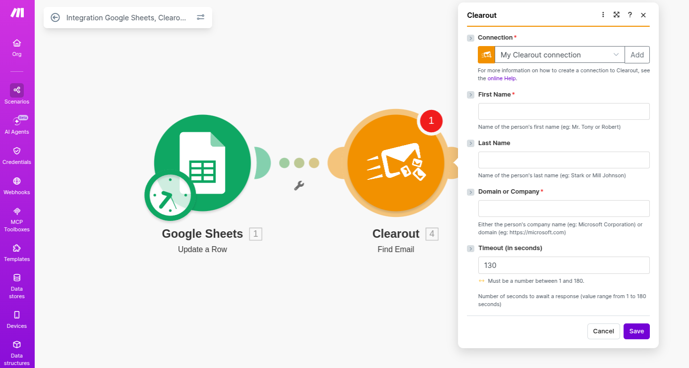

# Make

**Make** is a visual automation platform that lets you build multi-step workflows between Clearout and almost any online service, without writing code. You can use it to verify emails automatically whenever data moves between your forms, CRMs, sheets, and other tools.

### Verify emails in Make in Just 6 simple steps 



### **Connect with Make**

To integrate Clearout with any other app via Make, you need a Make account.​ If you don’t have one, [create a Make account](https://www.make.com/en/register?utm_source=clearout\&utm_medium=partner\&utm_campaign=clearout-partner-program)

<figure><figcaption></figcaption></figure>




### Create a new scenario 

* **Log in** to your Make account.
* Click **Create a new scenario** to start building your workflow

<figure><figcaption></figcaption></figure>




### Set up a trigger connection

Every scenario starts with a module (connector) that triggers the workflow. For example, using **Google Sheets**:​

* Add **Google Sheets** as the first module.
* Connect your Google account to Make.
* Select the spreadsheet file and worksheet that contains the email addresses, then click **OK**.​

You can use any other trigger app (forms, CRM, etc.) in the same way.

<figure><figcaption></figcaption></figure>




### Select a Clearout action

After configuring your trigger, add a Clearout module to perform the desired action:​

* In the next empty module, search for **Clearout** and select it.
* From the list of available actions, choose one based on your requirement.
* Click **OK** to proceed.​

Clearout provides the following **key actions** in [Make.com](https://make.com)

**Verify Email Address**

Validate an email address to check its deliverability and quality

This action takes an email from the previous module and verifies whether it is:

* Valid
* In-valid
* Catch-all
* Disposable
* Risky

Using this, you can reduce bounce rates and improve email campaign performance.

<figure><figcaption></figcaption></figure>

**Find Email**

Find a professional, pre-verified email address using:

* Person’s name
* Company domain

Each result includes a confidence score indicating the likelihood of the email being valid.

This is useful for:

* Lead generation
* Prospecting
* Outbound workflows

<figure><figcaption></figcaption></figure>




### **Connect your Clearout account**

* In the Clearout module, click **Add** to create a new connection.​
* When prompted, paste your **Clearout API Token**

**Generate your Clearout API key:**

* **Log in** to your Clearout Account.
* Go to [**Developer → API**](https://app.clearout.io/developer/api/list).
* Click **Create API Token** to generate a new token.
* Copy the token and paste it into the **Create a connection** popup in Make, then save.

<figure><figcaption></figcaption></figure>




### **Execute the scenario**

After all modules are configured:

1. Click **Run once** (or **Run**) in Make to execute the scenario.
2. Check the Clearout module’s output to see verification results for each processed email.

<figure><figcaption></figcaption></figure>

From here, you can add more modules (filters, routers, CRM updates, notifications) to route valid and invalid emails differently, fully **automating your verification flow with Make and Clearout.**


